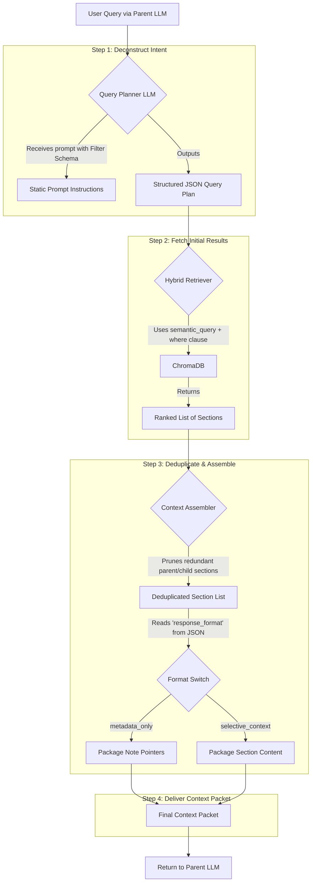

# Second Brain RAG Micro-Agent - Product Requirements Document v2

## 1. Project Overview

### Vision
To build a highly specialized RAG "micro-agent" that provides a parent Language Model with the precise context it needs to reason about a user's personal knowledge base. The agent's primary function is to intelligently retrieve and package notes, sections, and metadata, serving as a trusted "context provider" rather than a standalone chat application.

### Problem Statement
Parent LLMs lack direct, structured access to a user's personal notes. Existing solutions either fail to provide context or dump large, irrelevant text blobs, which contaminates the context window and leads to poor responses. A specialized tool is needed to bridge this gap. This micro-agent will solve:
- **No contextual retrieval**: Chatbots get content snippets without knowing the source note, its structure, or its relationships.
- **Poor filtering**: Natural language queries like "notes from last week" are not translated into precise metadata filters.
- **Context redundancy**: Retrieving both a child section and its parent (e.g., an H4 and the containing H2) wastes tokens and adds noise.
- **Loss of structure**: Notes are treated as semantic blobs, losing the rich context of headings, wikilinks, and file structure.

### Solution Approach
A micro-agent built on a multi-stage, planner-led retrieval architecture. The agent intelligently deconstructs a user's query, performs a precise hybrid search, eliminates redundant information, and strategically packages the context for the parent LLM, providing either high-level metadata or selective content as needed.

## 2. Core Architecture: The Query Planner Model

The core of this system is an LLM-powered **Query Planner**. It acts as the "brain" of the micro-agent, translating ambiguous natural language into a precise, machine-executable plan.



### Key Stages:
1.  **Query Planning**: The Query Planner LLM analyzes the user's request and generates a JSON object specifying a semantic query, metadata filters, and the desired response format (`metadata_only` or `selective_context`).
2.  **Hybrid Retrieval**: The system executes a single, efficient query against ChromaDB, using the planner's output to filter by both metadata and semantic relevance simultaneously.
3.  **Context Deduplication**: A post-processing step removes redundant results, ensuring that if a child section (e.g., H3) is matched, its less-specific parent (e.g., H2) isn't also included from the same relevance score.
4.  **Strategic Packaging**: The final context is assembled into one of two formats to give the parent LLM maximal flexibility with minimal token waste.

## 3. Data and Technical Specification

### Tech Stack
-   **Language**: Python
-   **Vector Database**: ChromaDB (stores embeddings and filterable metadata)
-   **LLM Framework**: LangChain
-   **Embedding Model**: `Qwen/Qwen3-8B-Instruct-GGUF` 
-   **Query Planner LLM**: A local or API-based LLM tasked with query deconstruction.

### Data Structures
The system's data representation is designed to capture the rich structure of markdown notes, based on `note.py` and `parsing.py`.

```python
# Represents a single content chunk within a note, created by splitting by heading.
# Defined in: parsing.py
@dataclass
class ContentSection:
    id: str          # Unique identifier for the section
    heading: str     # The heading text (e.g., "Two-Stage Retrieval")
    content: str     # The full markdown content under this heading
    level: int       # The heading level (1 for #, 2 for ##, etc.)

# A comprehensive representation of a single markdown note file.
# Defined in: note.py
@dataclass
class Note:
    file_path: str
    title: str
    created_date: datetime
    modified_date: datetime
    wikilinks: List[str]      # Links like [[My Other Note]]
    tag_wikilinks: List[str]  # Links from the 'Tags:' line, e.g., [[#project]]
    content_sections: List[ContentSection] # The note's body, chunked by heading
```

### Stored Metadata in ChromaDB
Each `ContentSection` is stored in ChromaDB with the following filterable metadata, based on `main.py`:
-   `title`: The title of the note.
-   `file_path`: The original file path.
-   `created_date`: Note creation date (ISO string).
-   `modified_date`: Note modification date (ISO string).
-   `tags`: Comma-separated string of wikilinks found in the `Tags` section.
-   `wikilinks`: Comma-separated string of wikilinks not found in the `Tags` section.
-   `heading`: The heading of the specific section.
-   `level`: The heading level (1-6).

## 4. Response Formats

The micro-agent will deliver one of two context packages, as determined by the Query Planner. This gives the parent LLM the right level of detail for the task at hand.

-   **`metadata_only`**: The default, high-efficiency format. Returns a JSON object containing a list of note "pointers." This is for broad queries, allowing the parent LLM to see what was found before requesting full content via another tool call.
    ```json
    {
      "results": [
        {
          "id": "path/to/note.md::Heading Text",
          "title": "Note Title",
          "heading": "Heading Text",
          "tags": ["#project", "#RAG"]
        }
      ]
    }
    ```
-   **`selective_context`**: The high-precision format. Used for specific questions where the content is likely the answer. Returns the actual text of the most relevant, deduplicated sections.
    ```json
    {
      "results": [
        {
          "id": "path/to/note.md::Heading Text",
          "title": "Note Title",
          "content": "The full markdown content of the relevant section...",
          "metadata": { ... }
        }
      ]
    }
    ```

## 5. Success Metrics

### Functional Requirements
-   [x] Extract metadata from note files (`note.py`, `parsing.py`).
-   [x] Generate clean embeddings for text sections (`embed.py`).
-   [x] Store documents and metadata in ChromaDB (`main.py`).
-   [ ] Implement the Query Planner LLM to generate structured JSON.
-   [ ] Implement the Hybrid Retriever using the planner's output.
-   [ ] Implement context deduplication logic.
-   [ ] Implement the two-tiered response packaging (`metadata_only`, `selective_context`).

### Project Completion Tests
The project is successful when the parent LLM can successfully use the micro-agent to answer these queries, demonstrating the full retrieval pipeline.
-   **Test 1 (Metadata + Semantic)**: *"Show me all the notes that include references to CVE-2025-1235 I wrote this month."* This should trigger a `selective_context` response.
-   **Test 2 (Broad Semantic)**: *"Give me a list of recon TTPs from my notes."* This should trigger a `metadata_only` response, allowing the parent LLM to see the relevant notes before proceeding.
-   **Test 3 (User Experience)**: A user's query for *"RAG notes from this month that mention ChromaDB but aren't tagged as draft"* is correctly deconstructed by the planner and returns precise, non-redundant results.
#### Target User Queries
1. **Temporal**: "What did I write about machine learning last month?"
2. **Topical**: "Find my notes on attention mechanisms"
3. **Relational**: "Show me everything linked to [[Transformers]]"
4. **Visual**: "That note with the system architecture diagram"
5. **Compound**: "Recent RAG notes that mention ChromaDB"
6. **Specific References**: "Show me all notes that include references to CVE-2025-1235 I wrote this month"
7. **Multi-criteria**: "Give me a list of recon TTPs and the note they were found in that will be helpful in an engagement where the target is primarily windows and active-directory/azure"
8. **Visual Context**: "Show me that note with the diagram of red team TTPs"
9. "From my notes, compile a summary of everything I've learned about infostealer malware"
