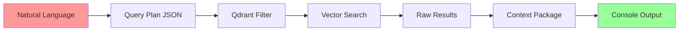

# Detailed Query Flow - Collection Exists with Documents

## Complete Query Processing Pipeline

```mermaid
flowchart TD
    A[User Query: find my notes about RAG] --> B[main.py:run_query]
    
    B --> C[LLMConfig.from_env]
    C --> D[VectorStoreManager(config)]
    D --> E[Collection: obsidian_notes]
    
    E --> F[deconstruct_query]
    F --> G[OpenAI API Call]
    G --> H[JSON Query Plan]
    
    H --> I[retrieve_context]
    I --> J[_build_qdrant_filter]
    J --> K[Filter Object Creation]
    
    K --> L[vector_manager.search_documents]
    L --> M[Qdrant Hybrid Search]
    M --> N[Semantic + Metadata Filtering]
    
    N --> O[Results Processing]
    O --> P[_package_metadata_only OR _package_selective_context]
    
    P --> Q[Format Results]
    Q --> R[Console Output]
    
    style A fill:#ff6b6b,stroke:#333
    style M fill:#4ecdc4,stroke:#333
    style R fill:#45b7d1,stroke:#333
```

## Step-by-Step Breakdown

### 1. Query Input Processing
- **Entry**: User types `python main.py find my notes about RAG`
- **Function**: `run_query(query: str)` receives the raw query
- **Output**: Clean query string ready for processing

### 2. System Initialization
- **LLMConfig**: Loads from environment variables
  - OPENROUTER_API_KEY
  - QDRANT_URL
  - MODEL_PATH
- **VectorStoreManager**: Establishes Qdrant connection
  - Collection: obsidian_notes
  - Vector size: 1024 (from config)
  - Distance metric: COSINE

### 3. Query Planning Phase
- **deconstruct_query()**:
  - **Input**: find my notes about RAG
  - **Process**: Sends to LLM with schema
  - **Output**: JSON structure
    ```json
    {
      semantic_search_needed: true,
      semantic_query: notes about Retrieval-Augmented Generation,
      filters: [],
      response_format: selective_context
    }
    ```

### 4. Filter Construction
- **_build_qdrant_filter()**:
  - **Input**: filters array from query plan
  - **Process**: Converts to Qdrant Filter object
  - **Output**: Filter(must=[...]) ready for search

### 5. Search Execution
- **vector_manager.search_documents()**:
  - **Query**: semantic_query from plan
  - **Filter**: Qdrant Filter object
  - **k**: 20 (default)
  - **Process**: Hybrid search combining vector similarity + metadata filtering

### 6. Qdrant Operations
- **Search Pipeline**:
  1. **Embedding Generation**: Query text → 1024-dim vector
  2. **Pre-filtering**: Apply metadata filters
  3. **Vector Search**: Find similar documents
  4. **Post-processing**: Score thresholding, deduplication
  5. **Result Collection**: Gather top matches

### 7. Result Processing
- **retrieve_context()**:
  - **Input**: Search results + response_format
  - **Process**: 
    - Normalize document structure
    - Apply response format (metadata_only vs selective_context)
    - Package for output
  - **Output**: Structured context package

### 8. Output Formatting
- **Console Display**:
  - Query summary
  - Result count
  - Formatted results with:
    - Document title
    - Section heading
    - Content preview (200 chars)
    - Clean formatting

## Data Transformation Pipeline



## Key Technical Details

### Query Plan Structure
- **semantic_search_needed**: boolean indicating vector search requirement
- **semantic_query**: optimized text for embedding
- **filters**: array of metadata conditions
- **response_format**: metadata_only or selective_context

### Search Parameters
- **k**: 20 results max
- **score_threshold**: 0.0 (default)
- **filter**: Qdrant native filter object
- **embedding**: 1024-dimensional vector

### Result Processing
- **deduplication**: handled by Qdrant group_by
- **scoring**: cosine similarity
- **formatting**: consistent across all results
- **error handling**: graceful degradation